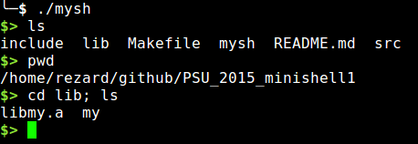

# PSU_2015_minishell1

Epitech first year project : [PSU] minitalk

Deadline : 3 weeks

Beginning of the project : 01/02/2016, 07h42

Group size : 1 person

# Minishell1

It is a UNIX command interpreter.

The command lines are simple, no pipe, no redirection or any other advanced. 

If an executable cannot be found, it display an error message.

## Getting started

These instructions will allow you to obtain a copy of the operational project on your local machine for development and testing purposes.

### Prerequisites

What do you need to install the software and how to install it?

```
gcc
make
```

### Installation

Here's how to start the project on your computer

Clone and go in the directory PSU_2015_minishell1

Project compilation

```
make
```

Running project

Server:
```
./mysh
```

## Screenshot



## Build with

* [C](https://en.wikipedia.org/wiki/C_(programming_language))

## Auteurs

* **David Munoz** - [DavidMunoz-dev](https://github.com/davidmunoz-dev)
